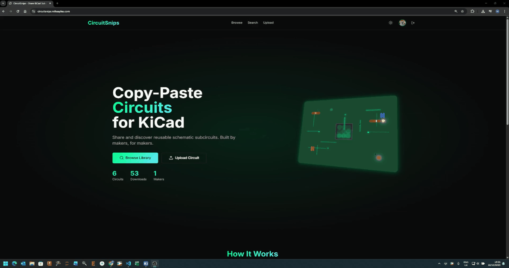

# CircuitSnips: A Thingiverse for KiCad

*A searchable database of 4,000+ ready-to-use KiCad schematics, all available under open source licenses*

## Media Coverage

### Featured In:

**[Hackaday: "An Online Repository For KiCad Schematics"](https://hackaday.com/2025/11/28/an-online-repository-for-kicad-schematics/)**
> Coverage of the platform filling a niche comparable to Thingiverse for electronics makers

---

## What It Does

CircuitSnips lets you search for common subcircuits - LiPo chargers, voltage regulators, protection circuits - and copy them straight into your KiCad project. No more reinventing the wheel for every weekend project.

The initial 4,000+ circuits were gathered from open-source GitHub projects, classified by license and quality using Gemini Flash 2.5. Users can upload their own designs, and there's box-selection in the viewer to grab just the portion you need from larger schematics.

[Read Full Technical Writeup →](#circuitsnips-com)
