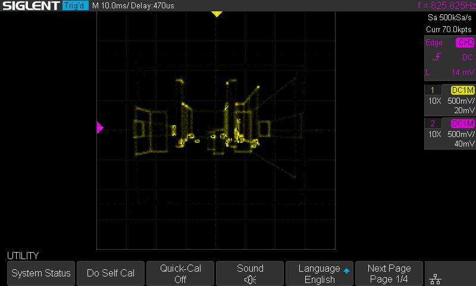

# ScopeDoom: DOOM on an Oscilloscope via Sound Card

*Turning a MacBook's headphone jack into a vector display*

<p align="center">
  
</p>

<p align="center">
  
</p>

---

## Why Sound Cards Make Terrible (But Fun) Vector Displays

After building [KiDoom](https://github.com/michaelayles/kidoom) (DOOM rendered as PCB traces in KiCad), I wanted to push the wireframe renderer somewhere more... physical. Oscilloscopes in X-Y mode are basically vector displays: feed X coordinates to one channel, Y coordinates to the other, and the electron beam traces out your shapes. The catch? Most people don't have an instrumentation DAC laying around.

But everyone has a sound card.

Your computer's audio output is a dual-channel DAC running at 44,100 samples per second. Left channel for X, right channel for Y. It's not *designed* for graphics, but it doesn't know that.

<p align="center">
  <table>
    <tr>
      <td></td>
      <td></td>
    </tr>
    <tr>
      <td align="center"><em>SDL Window (gameplay)</em></td>
      <td align="center"><em>Oscilloscope (wireframe)</em></td>
    </tr>
  </table>
</p>

---

## The Setup

### Hardware

The wiring couldn't be simpler:

```
MacBook Pro 3.5mm Jack
        |
        +--- Left (Tip) ----[1kΩ]----+---- Scope CH1 (X)
        |                            |
        +--- Right (Ring) --[1kΩ]----+---- Scope CH2 (Y)
        |                            |
        +--- Ground (Sleeve) --------+---- GND
```

The 1kΩ resistors provide a load for the headphone amplifier and knock down the signal level. Without them, you may get ringing. At this speed, you probably don't need to worry about things like probe capacitance, but you won't go wrong with a few pf to get rid of the dc offset. Laptop on battery, just to play it safe.

| Component | Model |
|-----------|-------|
| Computer | MacBook Pro (any with 3.5mm out) |
| Oscilloscope | Siglent SDS1202X-E |
| Load Resistors | 2× 1kΩ |
| Cable | 3.5mm to bare wires |

### Scope Settings

- **Mode:** X-Y
- **CH1 (X):** 500mV/div, DC coupling
- **CH2 (Y):** 500mV/div, DC coupling
- **Memory Depth:** 7k points

---

## The Software Pipeline

The architecture reuses KiDoom's vector extraction from DOOM's internal rendering structures:

```
DOOM Engine (C)
    |
    | drawsegs[] + vissprites[]
    v
Vector Extraction
    |
    | JSON over Unix socket
    v
doom_scope.py (Python)
    |
    | Convert to X-Y points
    v
sounddevice / PortAudio
    |
    | 44.1kHz stereo float32
    v
macOS CoreAudio
    |
    | Analog output
    v
Sound Card DAC → Oscilloscope
```

DOOM's engine already knows which wall segments and sprites are visible after BSP traversal. We intercept `drawsegs[]` (walls) and `vissprites[]` (entities), serialize them as JSON, and send them over a Unix socket. The Python side converts these to oscilloscope coordinates and streams them as audio samples.

### The Key Transformation

```python
def doom_to_scope(doom_x, doom_y):
    # DOOM: (0,0) top-left, (320,200) bottom-right
    # Scope: (-1,-1) to (+1,+1), Y inverted

    x = (doom_x / 320) * 2 - 1
    y = (doom_y / 200) * 2 - 1
    y = -y  # DOOM Y+ is down, scope Y+ is up

    return x, y
```

Each wall becomes a wireframe box (4 line segments). Each entity becomes a rectangle. The beam traces along each line, moves (blank) to the next segment, and repeats.

---

## A-B Comparison: SDL vs Oscilloscope

<p align="center">
  <table>
    <tr>
      <td></td>
      <td></td>
    </tr>
    <tr>
      <td align="center"><em>SDL: Full DOOM rendering</em></td>
      <td align="center"><em>Scope: Wireframe extracted geometry</em></td>
    </tr>
  </table>
</p>

The SDL window shows standard DOOM rendering—textured walls, sprites, lighting. The oscilloscope shows the same geometry stripped down to pure wireframes. You can trace the correspondence: each wall segment in the SDL view becomes a green rectangle on the scope, entities appear as boxes at their screen positions.

---

## The Numbers

| Metric | Value |
|--------|-------|
| Sample Rate | 44,100 Hz |
| Samples per Line | 30 |
| Blank Samples (retrace) | 3 |
| Points per Frame | 5,000–10,000 |
| **Effective Refresh** | **4–8 Hz** |

The math is simple: at 44.1kHz with ~7,000 points per frame, the scope redraws at about 6 Hz. That's *slow*—you're essentially watching a slideshow—but the level geometry is clearly recognizable.

```
Refresh Rate = Sample Rate / Points per Frame
             = 44,100 / 7,000
             ≈ 6.3 Hz
```

Compare this to an actual vector display like the Vectrex, which could manage 30,000+ points at 50Hz. Sound cards were designed for audio frequencies (20Hz–20kHz), not graphics bandwidth.

---

## The Limitations of Digital Scopes

This project really highlights why digital storage oscilloscopes (DSOs) make awkward vector displays:

### 1. Sample-and-Hold Display

Digital scopes capture waveforms and display them as a *static image* until the next trigger. There's no persistence like a CRT phosphor. The beam doesn't smoothly trace—you get discrete dots that the scope connects with interpolated lines. On my Siglent at 7k memory depth, this means visible stepping on diagonal lines.

### 2. Refresh Rate Coupling

The scope's display refresh is decoupled from the signal. Even if you send a continuous audio stream, the scope updates its display at its own rate (typically 30-60 Hz for the UI, but waveform acquisition depends on trigger settings). In X-Y mode with a continuous signal, you're at the mercy of how the DSO handles non-triggered acquisition.

### 3. Memory Depth Trade-offs

More memory depth = more points captured = smoother curves. But also slower refresh because there's more data to process. At 7k points I get reasonable fidelity; at 70k, 700k, 7M+ etc points the scope would take ages to update.

### 4. No Z-Axis Blanking

Analog scopes used to have Z-axis input (intensity modulation). You could blank the beam during retrace. Modern DSOs don't expose this—you can see the beam moving between segments as faint lines connecting the walls.

### 5. DC Offset Issues

Mac audio outputs are AC-coupled with significant DC bias (the capacitor-coupled design removes DC but introduces an offset). The image won't center properly without adding DC blocking capacitors in series with each channel.

### An Analog Scope Would Be Better

On a real analog oscilloscope in X-Y mode:
- True phosphor persistence would smooth out the low refresh rate
- Intensity naturally varies with beam speed (slow = bright, fast = dim)
- No sample/hold artifacts—continuous beam movement
- Higher bandwidth analog scopes can handle faster update rates

The digital scope *works*, but a £50 analog scope from eBay would actually look better for this application.

---

## Visual Quality: "Crunchy But Functional"

The honest assessment:

**What works:**
- Level geometry is clearly recognizable
- Walls have correct perspective projection
- Movement is responsive (you can play the game)
- It's *real hardware* displaying DOOM

**What doesn't:**
- Low refresh rate (4-8 Hz) causes obvious flicker
- Visible retrace lines between segments
- Aliasing/stepping on diagonal lines
- DC offset means the image isn't centered
- Brightness varies based on line length (more samples = brighter)

It's not pretty. But you can walk through E1M1 and recognize the starting room, the zigzag corridor, the first shotgun. The geometry is *correct*, just crude.

---

## Running It Yourself

### Quick Test (No DOOM)

```bash
cd ScopeDoom
python3 scope_wav_test.py      # Generate test WAV files
afplay scope_square.wav        # Play square pattern
# You should see a square on your scope
```

### Full DOOM Setup

```bash
# Terminal 1: Start scope renderer
python3 doom_scope.py

# Terminal 2: Launch DOOM
./doomgeneric_kicad -w 1 1
```

Play in the SDL window, watch the oscilloscope. WASD moves, arrows turn, Ctrl fires.

### Dependencies

```bash
pip install sounddevice numpy
# Optional for scope screenshots:
pip install python-vxi11
```

---

## What Would Make It Better

### Software
- **Point optimization** - Reduce samples per line for faster refresh
- **Path sorting** - Order segments to minimize retrace distance
- **Adaptive detail** - Fewer samples on small/distant walls

### Hardware
- **Higher sample rate** - 96kHz or 192kHz audio interface doubles/quadruples point budget
- **DC blocking caps** - ~10µF in series with each channel for centering
- **Z-axis blanking** - 3-channel audio interface, third channel to scope Z-input (brightness)
- **Analog scope** - CRT phosphor persistence would smooth everything

The ultimate setup would be a 192kHz audio interface with Z-axis output into an analog X-Y scope. That gets you ~4x the points with natural persistence and proper blanking. But then you're buying specialized hardware instead of using what's lying around.

---

## Why This Exists

Because DOOM runs on everything. Because sound cards are dual-channel DACs. Because oscilloscopes in X-Y mode are vector displays if you squint. Because the intersection of those facts demanded to be explored.

Is a 6 Hz refresh rate playable? Barely.
Is it practical? Not at all.
Does it prove sound cards can drive vector graphics? Yes.

There's something deeply satisfying about playing DOOM on test equipment. The oscilloscope doesn't know it's displaying a video game. The sound card doesn't know it's being abused as a graphics adapter. The MacBook doesn't know its headphone jack has been repurposed as an analog vector output.

They don't need to know. It works anyway.

---

## Credits

- **id Software** - DOOM (1993)
- **ozkl** - [doomgeneric](https://github.com/ozkl/doomgeneric) portable DOOM
- **Sprite_tm** - [Vectrex DOOM](http://spritesmods.com/?art=veccart&page=5) inspiration
- **Jerobeam Fenderson** - Oscilloscope music proof-of-concept

---

*Part of the KiDoom project. Because if DOOM can run on PCB traces, it can run on anything.*
