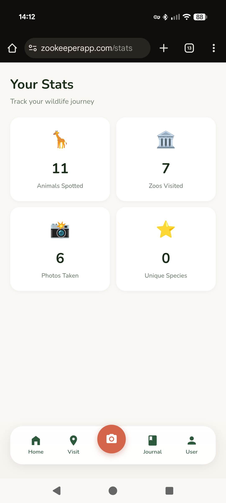

# Zookeeper: Pokédex for Real Zoo Animals

*Building a wildlife collection game for the Gemini 3 Hackathon*

<p align="center">
  
</p>

<p align="center">
  <table>
    <tr>
      <td></td>
      <td></td>
      <td></td>
    </tr>
    <tr>
      <td align="center"><em>Sign in with Google</em></td>
      <td align="center"><em>Home dashboard</em></td>
      <td align="center"><em>Animal checklist</em></td>
    </tr>
    <tr>
      <td></td>
      <td></td>
      <td></td>
    </tr>
    <tr>
      <td align="center"><em>Find a zoo nearby</em></td>
      <td align="center"><em>Track your progress</em></td>
      <td></td>
    </tr>
  </table>
</p>

---

## The Problem With Zoo Visits

Zoo visits are weirdly passive. You walk around, see some animals, maybe take a few photos, and by the time you're home you've forgotten half of what you saw. There's no sense of progression, no way to track what you've encountered across multiple visits. Kids especially lose interest after the first hour because there's no *game* to it.

Meanwhile, Pokémon Go proved that people will walk ridiculous distances to collect virtual creatures. What if we could capture that same energy for real animals?

That's Zookeeper. A mobile app that turns zoo visits into a collection game. Select your zoo, get an AI-generated checklist of animals, and tick them off as you spot them — either manually or by pointing your camera and letting Gemini identify what you're looking at.

---

## Why We're Building This

My girlfriend and I entered the Gemini 3 Hackathon together. Built for the requirement to build something *new* with the Gemini 3 API. We wanted something fun that we'd actually use ourselves.

We both like zoos. We both have that collector-brain that enjoys checking things off lists. And we noticed that existing zoo apps are either glorified maps or membership card holders. Nobody had built the obvious thing: a Pokédex for real animals.

The hackathon judging criteria weight "Innovation/Wow Factor" at 30%. A chat interface wouldn't cut it. We needed something with genuine utility that showcased what Gemini can do.

---

## How It Works

### The Core Loop

```
1. Select your zoo (or let GPS find it)
2. Get an AI-generated animal checklist
3. Walk around, spot animals
4. Either tap the checkbox, or...
5. Point your camera → Gemini identifies → Auto-check
6. Build your collection over time
```

The checklist is generated once per zoo and cached. We're not hitting the API every visit — that would be expensive and slow. Instead, Gemini generates a comprehensive animal list when a zoo is first added, categorised into Mammals, Birds, Reptiles, etc.

### The Vision Integration

This is where Gemini actually shines. When you take a photo:

1. The image goes to Gemini 3 Flash via OpenRouter
2. The prompt includes the zoo's animal list as candidates
3. Gemini returns either a confident match with a fun fact, or...
4. A playful rejection explaining what it *did* see

That second case was important to get right. If you photograph your dog by accident, or a random tourist, or a solid colour because your finger was over the lens — the app doesn't just say "ERROR: NOT AN ANIMAL." It says something like:

> "What a cute pup! But I don't think you're at the zoo right now... unless it's a very unusual zoo!"

We spent more time on the rejection messages than I'd like to admit. They're part of what makes the app feel friendly rather than clinical.

---

## The Tech Stack

| Layer | Choice | Why |
|-------|--------|-----|
| Frontend | React 19 + Vite | Fast, pleasant to dev |
| Styling | Tailwind v4 | Rapid iteration |
| State | Zustand | No Redux boilerplate |
| Backend | Cloudflare Pages Functions | Edge deployment, generous free tier |
| Database | Cloudflare D1 | SQLite at the edge |
| Photos | Cloudflare R2 | S3-compatible, cheap |
| Auth | Google OAuth + JWT | Everyone has a Google account |
| AI | Gemini via OpenRouter | Single API key, easy billing |

The Cloudflare stack deserves a mention. D1 gives us SQLite semantics with global edge distribution. R2 handles photo storage without the S3 pricing complexity. Pages Functions are just files in a `functions/` folder that become API routes. The whole backend deploys with `npm run deploy`.

### Data Model

The key insight was separating *global* from *private* data:

| Data | Ownership | Description |
|------|-----------|-------------|
| Zoos | Global | Shared master list, anyone can add |
| Animals | Global | AI-generated per zoo, shared |
| Visits | Private | Your trips, scoped to your account |
| Sightings | Private | Your spotted animals, your photos |

This means the AI generation cost is amortised across all users. First person to visit Chester Zoo triggers the animal list generation. Everyone after that gets it instantly from cache.

---

## The Design Language

We went through several iterations before landing on something that felt right. The final palette is earthy and warm:

- **Forest Green** (#2D5A3D) — Primary, trustworthy, nature-coded
- **Savanna Gold** (#D4A855) — Progress bars, achievements, warmth
- **Terracotta** (#D4654A) — Accents, the "oo" in the logo
- **Cream** (#FAF8F4) — Background, easy on the eyes outdoors

The vibe we were going for: "Duolingo's polish meets Airbnb's warmth." Playful but not childish. Professional but not sterile.

---

## Smart Zoo Ordering

A small detail that makes a big difference: the zoo selection list isn't alphabetical. It's ordered by:

1. **Nearby** — Within 100km of your current location
2. **Previously visited** — Zoos you've been to before
3. **Alphabetical** — Everything else

This uses the Haversine formula for geographic distance. The result is that when you open the app at the zoo, your zoo is probably already at the top of the list. Friction removed.

---

## What Gemini Actually Does

Three integration points:

### 1. Text Generation — Animal List Generation

When a zoo is first added, we prompt Gemini with:

```
List all animals currently on display at {zoo_name} in {country}.
Return JSON array with common_name, scientific_name, category,
exhibit_area, and a fun_fact for each.
```

Temperature 0.3 for factual accuracy. The model knows a surprising amount about which animals are at which zoos — probably from scraping zoo websites into its training data.

### 2. Vision — Animal Identification

When you take a photo:

```
You're helping identify animals at a zoo.
The zoo has these animals: {list}.
Look at this photo and determine what's in it.

IF it's a zoo animal: return name, confidence, fun_fact
IF it's NOT: return a playful rejection message
```

The candidate list constraint is important. Without it, Gemini might identify a "lion" when the zoo doesn't have lions. By providing the options upfront, we get matches that are actually useful.

### 3. Data Pipeline — UK Zoo Scraper

This one was surprisingly fun to build. We needed a comprehensive database of UK zoos with their animals. Wikipedia has a list of UK zoos, but no animal data. Zoo websites have animals, but inconsistent formats. The solution: a multi-source scraper that uses Gemini to do the heavy lifting.

The pipeline:

```
Wikipedia (zoo list) ─┬─→ Dedupe ─→ Geocode ─→ Fetch Animals ─→ D1 Database
BIAZA (zoo list)     ─┤                              ↑
Google (discovery)   ─┘                              │
                                               Gemini 3.0 Flash
```

The clever bit is how we prompt for animals. If you ask an LLM for "all mammals at Chester Zoo", you get maybe 20 highlights — the lions, elephants, giraffes. But Chester has 500+ species. We needed exhaustive lists.

The fix: subcategory prompting. Instead of "mammals", we ask for:
- Primates (monkeys, apes, lemurs)
- Big cats and wild cats
- Bears and raccoons
- Hoofed animals (deer, antelope, giraffes, zebras)
- Small mammals (meerkats, otters, mongoose)
- ...and so on

Each subcategory gets its own API call. The results get merged and deduplicated. The effect is dramatic — we went from ~40 animals per zoo to ~200.

```typescript
const MAMMAL_SUBCATEGORIES = [
  'Primates (monkeys, apes, lemurs)',
  'Big cats and wild cats',
  'Bears and raccoons',
  'Elephants and rhinos',
  'Hoofed animals (deer, antelope, giraffes, zebras)',
  // ... 5 more subcategories
];

for (const subcategory of MAMMAL_SUBCATEGORIES) {
  const animals = await fetchAnimalsBySubcategory(zoo, 'Mammals', subcategory);
  allAnimals.push(...animals);
}
```

We also ask for 5 fun facts per animal. The prompt explicitly requests "genuinely fascinating, surprising facts" rather than basic information. The result is that when you spot an elephant, you learn something actually interesting — not just "elephants are the largest land mammals."

The whole thing runs overnight, caches aggressively, and populates the D1 database. One-time cost to seed the data, then users get instant checklists.

---

## Things That Went Wrong

### Coordinate System Confusion (Again)

Every graphics project I do has a Y-axis bug. This one was no different. First implementation had the camera viewfinder mirrored because I assumed KiCad's coordinate system (Y increases downward) when the web canvas works the same way. Fixed by removing the fix I'd preemptively added.

### OAuth Cookie Hell

Google OAuth with JWT cookies sounds simple until you're debugging `SameSite` attributes across localhost vs production, http vs https, different port numbers. Ended up with a demo login mode for development that bypasses Google entirely.

### Photo Size Limits

First attempt sent full-resolution photos to Gemini. 4MB images. On mobile data. At a zoo with spotty WiFi. Now we resize to 800px max dimension and compress to 80% JPEG quality before base64 encoding. Still looks fine for identification.

---

## Current Status

The app is fully functional:

- Google sign-in with cloud sync
- Zoo selection with location awareness
- AI-generated animal checklists
- Camera identification with fun rejections
- Progress tracking and statistics
- Photo capture and storage

What's left before submission:

- [ ] 3-minute demo video
- [ ] ~200 word project description
- [ ] Final polish pass
- [ ] Migrate from OpenRouter to Google's Gemini API directly

The hackathon requires a public demo link. We're deployed on Cloudflare Pages at a URL I'll share once we've submitted.

---

## What We Learned

Building for a hackathon with a partner is different from solo projects. You have to actually explain your decisions instead of just making them. Code has to be readable because someone else needs to understand it. Design choices get debated rather than assumed.

It's slower in some ways, faster in others. Slower because communication takes time. Faster because two people catch bugs twice as fast and the motivation to not let your partner down keeps you shipping.

The Gemini integration was smoother than expected, I've got quite a lot of experience building with it now. The vision model is genuinely good at animal identification — better than I thought it would be. The main limitation is our prompt engineering, not the model's capability.

---

## Try It

The app is live at [zookeeperapp.com](https://zookeeperapp.com). The code is at [github.com/MichaelAyles/zookeeper](https://github.com/MichaelAyles/zookeeper).

If you're at a zoo and want to beta test, let me know. We need real-world usage data before the deadline.