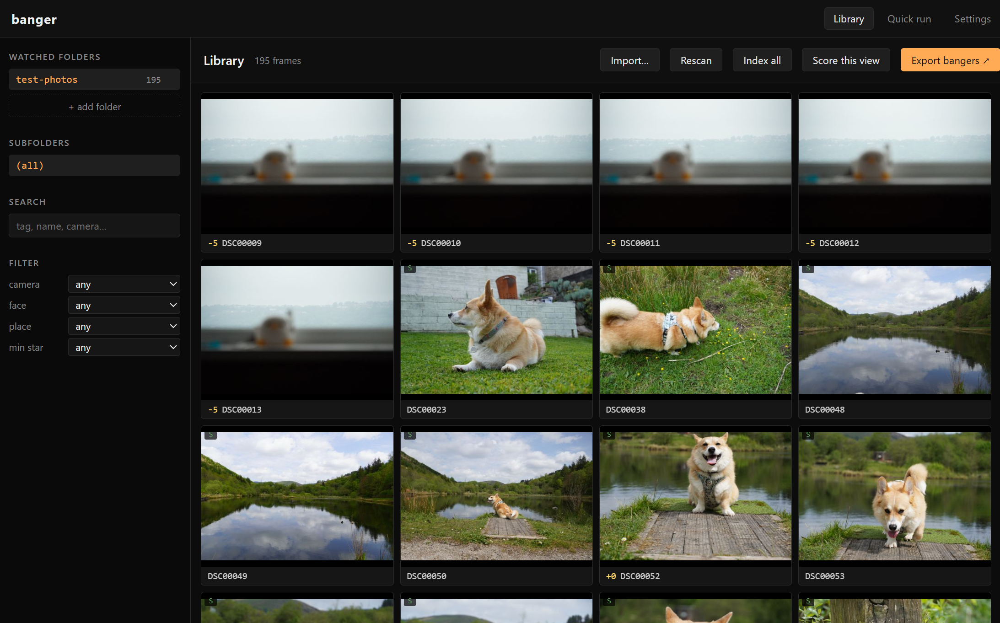
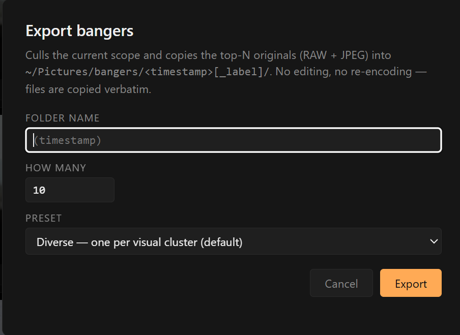
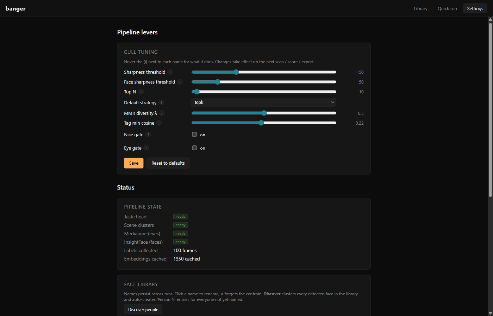

## The problem

I treat photography as a tool, not an art. To me it's documenting things I've seen, but quite often I feel like the photos I take don't reflect what I'm seeing. Until recently my tool of choice has been my Pixel. I picked up a Camera to: 1. see if it takes better photos, and 2. see if it makes me take better photos.

Culling the resulting photos absolutely sucks though, which is what led me to build this. Most are near-duplicates anyway. Out-of-focus shots and anything that fails the aesthetic gate get culled automatically, and from there I can either ask for 10ish keepers out of a day of 100 to 200 frames, or cut that pile in half for me to manually cull from.

Aftershoot, Narrative Select, and Optyx all solve this commercially and they solve it well, but they're cloud-backed subscriptions that want your library uploaded, and at least one of them wants a phone in the loop. I don't want any of that. The photos already live in folders on my laptop. The keepers should come out as files in another folder.

So I built one. Banger is a local photo culler. Point it at the folders you already keep your photos in, hit **Index all**, then **Export bangers**. You get a folder of the keepers, copied byte-for-byte, with a self-contained HTML gallery showing why each one made the cut. No cloud, no upload, no account.



## What it does, in one paragraph

For every photo in every watched folder, banger extracts EXIF + GPS (reverse-geocoded offline, so "swansea" or "keswick" works as a search term), computes a CLIP ViT-B/32 embedding, runs that embedding through a vocabulary of ~180 tag prompts to label the frame ("hiking, couple, valley, smiling, drone shot"), measures sharpness via Laplacian variance, scores exposure / contrast / colour harmony / composition / leading lines, detects faces with insightface ArcFace and clusters them across the library so naming a person once tags every photo of them forever, assigns the frame to a scene cluster via KMeans on the embedding, and gives it an aesthetic score. All of that lives in SQLite + per-frame JSON sidecars under `~/.local/share/banger-pipeline/`. After the first pass, culling and filtering are instant SQL reads.

## The interesting bits

Most of the pipeline is unsurprising. CLIP for embeddings, scikit-learn for clustering, OpenCV for the quality metrics. The parts worth talking about are the ones where the obvious approach is wrong.

### Aesthetic scoring: prompts → personal taste

The first version used `aesthetic-predictor-v2.5` (SigLIP-so400m). It's the right tool. It also segfaults `torch.UntypedStorage.__getitem__` on Windows somewhere above the 2 GB mmap-slice threshold. The 3.3 GB safetensors file would not load. Smaller safetensors files were fine. After an evening of staring at backtraces, I gave up and fell back to CLIP ViT-B/32 (~600 MB) with prompt-based scoring.

The scoring works by computing the difference between average cosine similarity to a small set of "good photo" prompts and a small set of "bad photo" prompts. One detail that took me longer than it should have: I deliberately *omitted* prompts about blur and focus from the negative set. The sharpness gate (Laplacian variance) already filters real motion blur, and CLIP cannot distinguish intentional bokeh from accidental blur, so a "blurry" negative double-counts the sharpness gate AND punishes every shallow-DOF portrait you take.

Generic prompts can't capture personal taste anyway. Once you've used the labelling UI to rate enough frames on a -5..+5 scale, `banger train` fits a Ridge regressor on the cached CLIP embeddings and replaces the prompt scorer with a head calibrated to *your* labels. Same embeddings, no re-encoding cost. The next time the pipeline runs, the aesthetic column reflects what you actually liked, not what CLIP thinks the platonic ideal photo looks like.

### MMR over top-K

Plain top-K by aesthetic score is the obvious selection strategy and it's almost always wrong. On a real dataset, the top 10 frames are 10 nearly-identical portraits from the one well-lit minute of the day. You wanted a highlight reel; you got a contact sheet.

MMR (maximal marginal relevance) fixes this by greedily maximising:

```
score(i) = λ * normalised_aesthetic(i) - (1 - λ) * max_cosine_to_already_picked(i)
```

Each pick is penalised for being too similar to a previous pick. λ = 1.0 reproduces top-K (no diversity penalty). λ = 0.0 picks the most-different frames regardless of score. λ = 0.5 is the default for a 10-frame highlight reel and reliably stops the "ten portraits from one good minute" failure mode.

For larger exports there's a `kmeans` strategy that does the same job differently. Cluster the candidate embeddings into N visual groups, pick the best frame per cluster. Cleaner for portfolio-style "show me variety across the trip" exports. MMR is better when you want a continuous diversity knob.

### Face identity: the Aftershoot cheat

Aftershoot, Narrative Select, and Optyx all share the same trick: cluster photos by *who appears in them*, then surface one good shot per person. CLIP embeddings capture visual diversity but not identity diversity. If the same crew is in every well-lit frame, kmeans-on-CLIP will happily return ten near-duplicates of the same group because they all sit in the same "people in light" subspace.

Banger uses insightface's `buffalo_l` detector + ArcFace recogniser to extract 512-dim face embeddings, then DBSCAN on cosine distance to cluster faces across the entire library. The DBSCAN cutoff is 0.5, which is the value the insightface community settled on as a robust "same person" threshold. Faces that don't fit any cluster are left as noise rather than spawning their own clusters. Rogue side-of-head detections shouldn't become Person 47.

The clustering runs *across the whole library*, not per folder. Name Beth once on a photo from last year and every Beth photo in every folder gets tagged Beth forever. This single decision is the difference between "useful person filter" and "another tagging chore." The named-face centroids persist to a separate SQLite DB and survive cache wipes.

### Quality metrics that pull their weight

The CV stack is more interesting than the usual "throw OpenCV at it" approach because most metrics need to be calibrated against the failure mode you actually care about:

- **Sharpness**: Laplacian variance, classic. Used as a gate, not a feature. Frames below the threshold are dropped before they reach scoring. Cheap to compute, brutal on motion blur.
- **Exposure**: percentile-based shadow/highlight clipping, with a silhouette detector that flags intentional silhouettes so they don't get penalised as "blown highlights."
- **Composition**: rule-of-thirds detection from the saliency map. Imperfect but useful as a tiebreaker.
- **Leading lines**: Hough transform on the edge map. Surprisingly effective as a "this frame has structure" signal.
- **Noise**: Immerkaer's estimator (one of those satisfyingly elegant little algorithms).
- **Dynamic range**: log2 ratio of the 99th and 1st luminance percentiles, in stops.

None of these alone picks good photos. Combined with the aesthetic head, they keep the gate honest. A frame can't sneak through the taste regressor if it's clipped to white.

## Export bangers



The whole point of the tool is this one modal. Pick how many keepers, pick a preset, hit Export. Output:

```
~/Pictures/bangers/2026-05-13_1718_caminito-trip/
  DSC00012.JPG                  ← originals, copied verbatim
  DSC00012.ARW                  ← RAW siblings come along automatically
  DSC00013.JPG
  ...
  manifest.json                 ← per-pick stats (rank, sha, sharpness,
                                   aesthetic, tags, faces, EXIF)
  gallery.html                  ← self-contained dark-themed HTML gallery
                                   with thumbnails embedded as base64
```

Seven presets: Best, Diverse, Mixed, People, Landscapes, Pets, Food. The subject presets (Landscapes / Pets / Food) nudge rather than filter. A +0.3 score boost lifts frames whose tags include the relevant vocabulary (`mountain / valley / forest / beach` for Landscapes; `dog / cat / horse / bird` for Pets), but everything else is still eligible. A landscape with a dog in it doesn't get dropped from the Landscapes preset.

The `gallery.html` is the part I'm quietly proud of. One file, no assets, no server, no external dependencies. Open it in any browser, on any machine, and you get a dark-themed grid of the keepers with hover-over stats. You can drop it on a USB stick, email it, or upload it to a static host. It's the artifact most people actually want at the end of a culling session.


## Settings



Every pipeline lever is a slider with a hover tooltip. Sharpness threshold, face sharpness threshold, top N, default strategy, MMR diversity λ, tag min cosine, face gate, eye gate. Persisted to `settings.json`. There's also a face library panel for renaming / forgetting / discovering people, and a pipeline-state card showing whether the taste head and scene clusters are trained and how many labels you've collected.

The eye gate is mediapipe-backed. It rejects frames where someone's eyes appear closed. Useful for group shots, but mediapipe is heavy and installs in the background after first launch.

## What banger deliberately doesn't do

- **No editor, no develop pipeline, no retouching.** Banger picks keepers; another tool develops them. Originals come out of Export byte-identical to what went in. This is non-negotiable. If the tool ever modified a RAW file I'd never trust it again.
- **No cloud sync, no web service, no phone app.** Files-only is the value proposition.
- **No video.** Library currently skips .mp4. Pixel and DJI bodies mix videos with photo folders; for now they're invisible.
- **Not multi-tenant.** Single-user app on a single laptop.

## Stack

Python 3.11+, PyTorch + CUDA, transformers (CLIP ViT-B/32), insightface (ArcFace), mediapipe (FaceMesh / EAR), rawpy for RAW decoding (Sony / Canon / Nikon / Fuji / Pentax / Olympus / Panasonic / DNG / and the long tail), imagehash for perceptual deduplication, scikit-learn, reverse_geocoder, Flask for the labelling UI, pywebview for the native desktop window.

128 tests, ~10 seconds to run.

## What's next

The clear next step is a per-user benchmark. Feed banger 1,000 frames I've manually triaged and measure agreement with my picks across the strategies. The taste head should win convincingly after a few hundred labels. If it doesn't, the prompt scaffolding needs work before more sliders do.

After that, video. Pixel and DJI mixed-media folders are the obvious gap, and the same CLIP-frame approach (sample N frames per clip, score, dedupe against the photo embeddings) should slot in without restructuring the pipeline.

Longer term, I want to swap the prompt-based aesthetic back to SigLIP once I'm off the Windows box that segfaults on it. The Ridge head over CLIP is fine, it's calibrated to my labels and that's what actually matters, but a better base score gives the regressor a stronger starting point.

---

**Source Code**: [GitHub](https://github.com/MichaelAyles/photo-ingest)