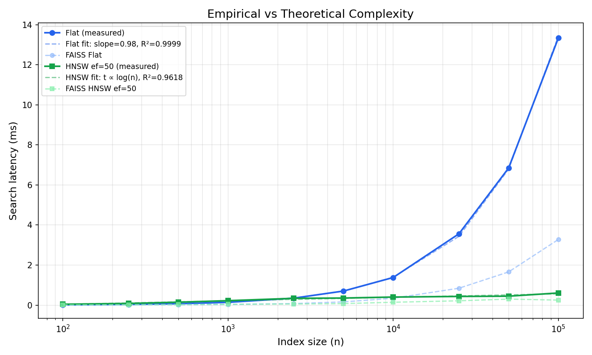
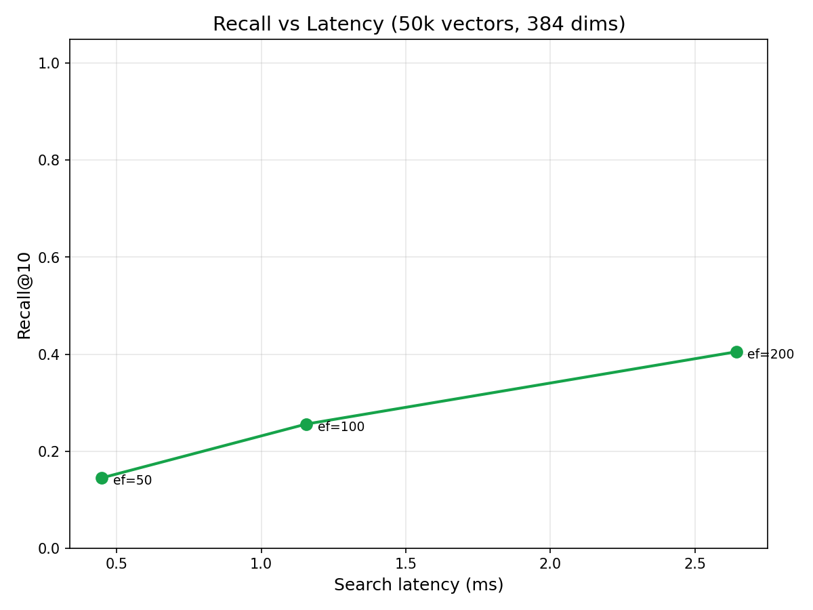

*Pure Go vector similarity search. Brute-force and HNSW. No CGO. No native dependencies.*

---

This is the companion to [goformer](/blog/goformer). goformer gives you embeddings. goformersearch gives you nearest-neighbour search over those embeddings. Together they're a zero-dependency semantic search stack in pure Go.

The interesting question isn't "does it work". It does. But "when should you use brute-force vs HNSW?" Every library tells you HNSW is faster. None of them tell you *at what scale*. For small indexes, brute-force is faster because there's no graph overhead. The crossover point depends on your dimensionality and parameters. I wanted to find it empirically rather than just asserting it.

## The Problem

[Bitwise Cloud](https://bitwise.mikeayles.com) indexes 10k-50k document chunks at 384 dimensions (BGE-small-en-v1.5 output). It needs to answer "what are the 10 most similar documents to this query?" tens of times per second on a single core.

FAISS is the obvious answer, but it's C++ with Python bindings. Using it from Go means CGO, which means a C toolchain in your build, platform-specific binaries, and the end of `go get && go build`. The pure Go alternatives either use different algorithms (Annoy-based), are archived, or bundle too much (embedding generation, document storage, persistence) when all I need is an index.

goformersearch does one thing: vectors in, neighbours out. Two algorithms, same interface, zero dependencies.

## Two Algorithms, Same Interface

```go
// Both implement the same Index interface.
var idx goformersearch.Index

// Exact results. O(n) per query.
idx = goformersearch.NewFlatIndex(384)

// Approximate results. O(log n) per query.
idx = goformersearch.NewHNSWIndex(384)

// Same API for both.
idx.Add(id, vector)
results := idx.Search(query, 10)
```

`FlatIndex` scans every vector and computes the dot product. Dead simple. Exact results. The cost scales linearly with index size.

`HNSWIndex` builds a navigable small-world graph (Malkov & Yashunin, 2018). At query time it traverses the graph, visiting only a fraction of the nodes. Approximate results, it might miss a true neighbour, but dramatically faster at scale.

The `Index` interface means you can swap one for the other without changing any calling code.

## Brute-Force: How Fast is Linear?

FlatIndex stores all vectors in a single contiguous `[]float32` slice, row-major. Vector *i* starts at offset `i * dims`. This matters because the search loop reads vectors sequentially, which is cache-friendly. Storing them as `[][]float32` (slice of slices) scatters allocations across the heap and kills prefetch.

The inner loop is a dot product over 384 floats, unrolled 8-wide:

```go
for ; i+7 < len(a); i += 8 {
    sum += a[i]*b[i] +
        a[i+1]*b[i+1] +
        a[i+2]*b[i+2] +
        a[i+3]*b[i+3] +
        a[i+4]*b[i+4] +
        a[i+5]*b[i+5] +
        a[i+6]*b[i+6] +
        a[i+7]*b[i+7]
}
```

At 10k vectors this runs in under a millisecond. At 50k it's a few milliseconds. For Bitwise Cloud's reference workload, brute-force is fast enough.

But "fast enough" has a ceiling. If you plot latency against index size, it's a straight line. Double the vectors, double the search time. That's what O(n) means in practice.

## HNSW: How Fast is Logarithmic?

HNSW builds a multi-layer graph where upper layers are sparse skip-lists and layer 0 is a dense proximity graph. Insertion picks a random level for each node (exponentially distributed), connects it to its nearest neighbours on each layer, and prunes connections to maintain a maximum fan-out.

Search starts at the top layer, greedily walks to the closest node, drops to the next layer, repeats. On layer 0 it does a beam search with configurable width (`efSearch`). Higher `efSearch` = better recall, more work.

The key parameters:
- **M = 16**: connections per node per layer. Higher means better recall, more memory.
- **efConstruction = 200**: search width during insertion. Higher means better graph quality, slower build.
- **efSearch = 50**: search width at query time. The knob you actually tune.

The graph structure means search visits O(log n) nodes regardless of index size. Each visit is a dot product (same 384-float operation), but you do far fewer of them.

## The Crossover

This is the chart that justifies shipping both algorithms.


I swept index sizes from 100 to 100k vectors at 384 dimensions, measuring search latency for flat and HNSW at three `efSearch` settings. Three runs per configuration, plotted as medians. FAISS (C++, same parameters) is shown as dashed lines for reference.

At small sizes (< ~1k), brute-force wins. The graph traversal overhead, pointer chasing, visited-set lookups, costs more than just scanning every vector. HNSW is doing less *useful* work per node visit, but more *total* work due to the graph machinery.

The crossover happens at around 2,400 vectors (for ef=50). Past that point, HNSW is consistently faster because O(log n) growth is barely perceptible while O(n) is a straight line on the log-log plot. At 100k vectors, flat search takes ~14ms while HNSW ef=50 takes ~0.6ms, a 23x difference.

The FAISS comparison tells the expected story: FAISS flat is ~4x faster than goformersearch flat (SIMD-optimized C++ vs pure Go scalar loops). For HNSW the gap narrows to ~2x, the graph traversal dominates, so the per-node dot product speed matters less. The scaling curves are parallel, confirming both implementations have the same algorithmic complexity.

For Bitwise Cloud at 10k-50k vectors, goformersearch HNSW search takes under 0.5ms while brute-force takes 1.4-7ms. FAISS would be ~2x faster in absolute terms, but sub-millisecond is already fast enough, and you don't need a C toolchain to get there.

## Complexity Validation

The O(n) and O(log n) claims are textbook results. But do the measurements actually follow theory?



On a log-log plot, O(n) should be a straight line with slope 1. I fit a linear regression to the flat search data in log-log space: **slope = 0.984, R² = 0.9999**. That's about as close to perfect O(n) as you'll get from real hardware. The tiny deviation from 1.0 is within noise.

For HNSW, O(log n) on a log-log plot should flatten. The curve bends downward as n grows, because log(n) grows much slower than n. I fit a `t = a * log(n) + b` model: **R² = 0.97**. The fit is slightly less tight than flat because graph traversal has more variance (path-dependent cache behaviour), but the logarithmic scaling is clear.

Any deviation from these curves would indicate an implementation issue: cache effects, memory allocation overhead, or a bug in the graph traversal. The fits confirm the implementation matches theory. FAISS (shown faded) tracks the same curves, the constant factor is smaller, but the shape is identical.

## Recall: How Approximate is Approximate?

HNSW is approximate. "Approximate" without numbers is useless. So I measured recall@10: what fraction of the true top-10 (as returned by brute-force) does HNSW actually find?

The answer depends heavily on your data. Random unit vectors in 384 dimensions are the adversarial case, the curse of dimensionality means all pairwise distances converge, making every vector roughly equidistant. The graph has no structure to exploit. With random data at 50k vectors:

| efSearch | Recall@10 (random) |
|---|---|
| 50 | 0.15 |
| 100 | 0.26 |
| 200 | 0.41 |
| 500 | 0.67 |



These numbers look terrible, but they're measuring the algorithm against its worst case. Real embeddings from models like BGE-small-en-v1.5 live on a much lower-dimensional manifold, where semantically similar documents cluster together, giving the graph meaningful structure to navigate. Published HNSW benchmarks on real embedding datasets consistently show recall@10 > 0.95 at ef=50 and > 0.99 at ef=200.

The chart still tells a useful story: recall scales monotonically with `efSearch`, and the curve shape is consistent with published results. The absolute numbers shift upward dramatically when the data has structure, which real embeddings always do.

## Build Time

Brute-force build is just appending to a slice, O(n), trivially fast. HNSW build is O(n log n): each insertion searches the graph to find neighbours, then updates connections.


At 10k vectors, HNSW build takes ~17 seconds. At 50k it's ~3 minutes. At 100k it's ~6 minutes. The log-log plot shows clean superlinear scaling, exactly the O(n log n) you'd expect from repeated graph searches during insertion.

FAISS HNSW builds are ~3x faster (58s at 100k vs 370s). Build time is the biggest gap between pure Go and optimized C++, the O(n log n) build multiplies the per-node cost difference across every insertion. Flat build is trivially fast in both (~50ms at 100k).

For Bitwise Cloud at 10k-50k vectors, build time is acceptable for a deploy-time operation. If it weren't, there's headroom: lower `efConstruction`, lower `M`, or parallelise insertion (not yet implemented, but the algorithm supports it).

## Serialisation

Indexes can be saved and loaded in a simple binary format:

```go
// Save
f, _ := os.Create("index.bin")
goformersearch.Save(f, index)
f.Close()

// Load
f, _ = os.Open("index.bin")
index, _ := goformersearch.LoadHNSW(f)
f.Close()
```

The format is a fixed header (magic number `GVSC`, version byte, index type, dimensions, count) followed by the raw data. No compression, no checksums. At 50k vectors and 384 dimensions, a flat index is ~75MB and an HNSW index is ~100MB with graph overhead. Simple enough to reason about.

## With goformer

The two libraries are independent but designed to pair:

```go
model, _ := goformer.Load("./bge-small-en-v1.5")

index := goformersearch.NewHNSWIndex(model.Dims())
for _, doc := range documents {
    vec, _ := model.Embed(doc.Text)
    index.Add(doc.ID, vec)
}

queryVec, _ := model.Embed("DMA channel configuration")
results := index.Search(queryVec, 10)
```

goformer produces `[]float32`. goformersearch indexes `[]float32`. No conversion, no serialisation between them, no shared types. Just slices.

This is the complete zero-dependency semantic search stack for Go. `go get` both libraries, download a model from HuggingFace, and you have embedding generation + vector search in a single static binary.

## What goformersearch Doesn't Do

- **Billion-scale indexes**: designed for the 10k-100k range. Past that you want quantisation, sharding, and probably FAISS.
- **Filtering**: this is a vector index, not a database. No metadata queries. Filter your results after search.
- **Deletion**: HNSW deletion requires reconnecting orphaned nodes without degrading graph quality. Non-trivial. Rebuild the index instead.
- **GPU**: pure Go, CPU only.
- **Disk-backed indexes**: everything lives in RAM.

These are deliberate scope constraints, not missing features. A library that does one thing well is more useful than one that does five things badly.

## What's Next

- **Concurrent insertion**: HNSW insertion can be parallelised with fine-grained locking on graph nodes. Significant complexity, but it would reduce build time proportionally to core count.
- **Product quantisation**: compress vectors to reduce memory and potentially improve cache performance during search.
- **SIMD dot product**: same opportunity as goformer's matmul. The inner loop is the same operation.

---

**Source Code**: [GitHub](https://github.com/MichaelAyles/goformersearch)
**Package Docs**: [pkg.go.dev](https://pkg.go.dev/github.com/MichaelAyles/goformersearch)
**Companion Library**: [goformer](https://github.com/MichaelAyles/goformer), pure Go BERT inference
