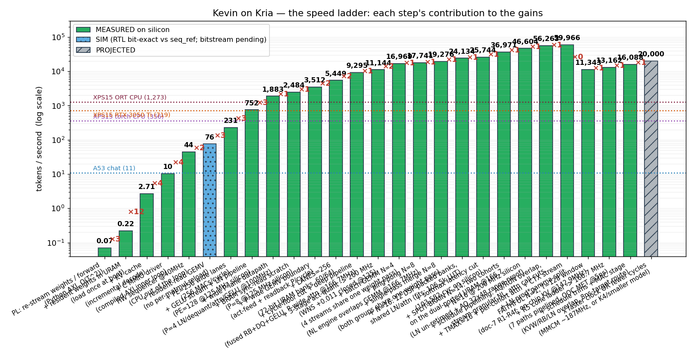
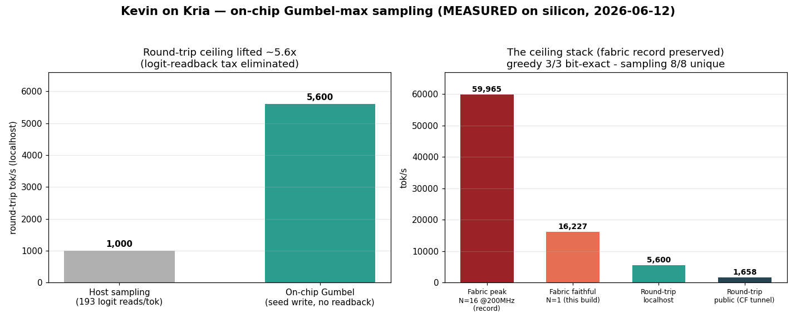
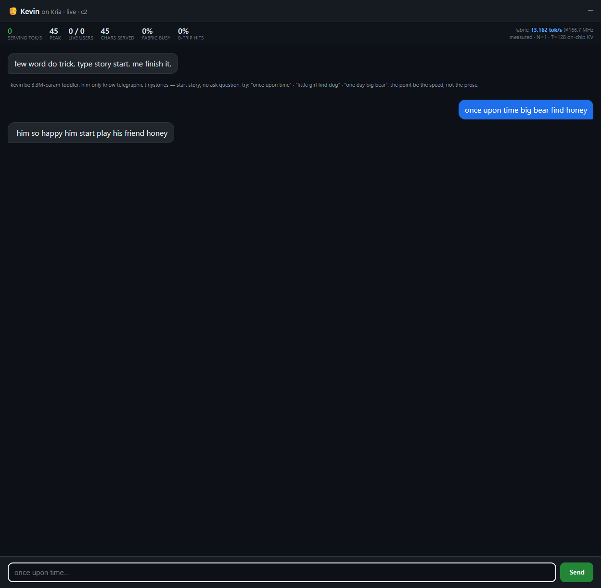
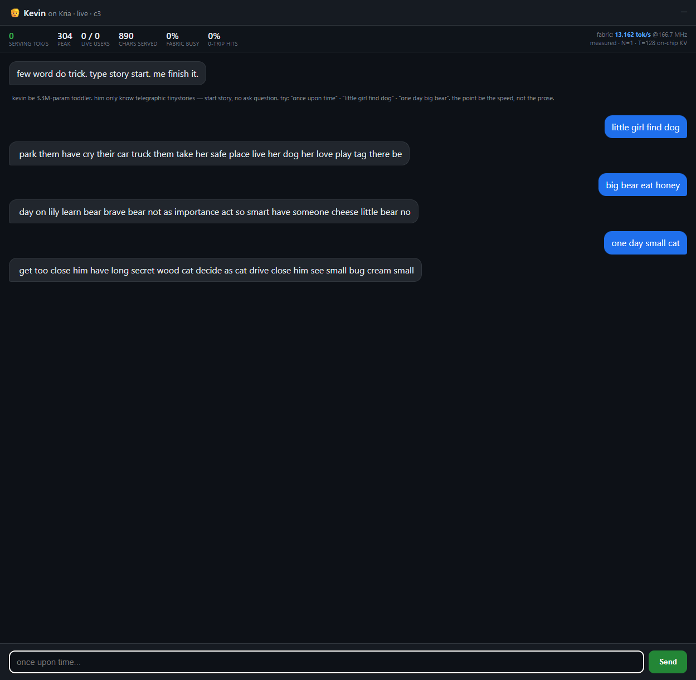
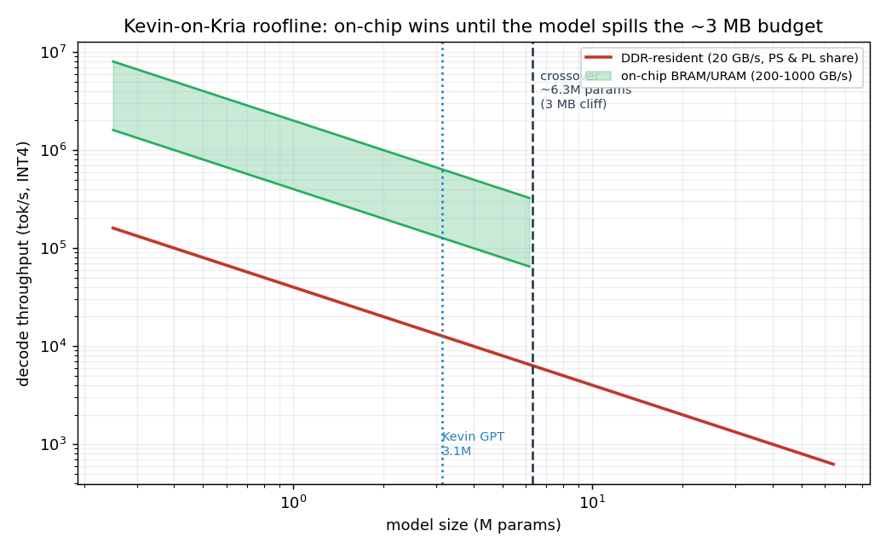

import KevinChat from '@/components/blog/KevinChat';
import NetworkTopology from '@/components/blog/NetworkTopology';
import PLBlock from '@/components/blog/PLBlock';
import BandwidthWall from '@/components/blog/BandwidthWall';
import GumbelTax from '@/components/blog/GumbelTax';
import T, { GlossaryStyles } from '@/components/blog/Term';

<GlossaryStyles />

*Why waste BRAM say lot word when few word do trick.*

---

I put a language model inside the <T id="fabric">fabric</T> of a $250 <T id="fpga">FPGA</T>.
Not next to it in <T id="ddr">DDR</T>, not streamed in over PCIe: inside, with every weight
resident in on-chip memory so they never touch external RAM. It talks like Kevin Malone from The Office, because the only way to fit
a useful model in a few megabytes of on-chip SRAM is to make it aggressively, deliberately
dumb. That turns out not to be a bug. It is the entire point.

The headline, bit-exact and measured on silicon: **59,965 tokens per second** on the
fabric. For comparison, the same model on this board's own Arm cores manages 11 tok/s, and
on my laptop's RTX 3050 Ti it manages 719. The $250 chip beats the laptop GPU by roughly
78x. The catch, stated honestly up front, is in what "token" means here and what the model
is allowed to remember. We will get to all of it.

First, talk to it.

## Chat with Kevin

This widget is a real WebSocket connection to the board. Your words go out through a
Cloudflare tunnel, to a serving box, to the Kria, into the fabric, and the reply comes back
the same way. If the status dot is green, you are talking to transistors.

<KevinChat client:visible />

Yes, it is bad at talking. That is the joke, and the joke is the thesis: a model small
enough to live entirely on-chip is necessarily stupid, and being on-chip is the only thing
that makes it fast. **Being dumb and being fast are the same property seen from two sides.**

---

## The highlights, for the impatient

- A 3.16M-parameter <T id="int4">INT4</T> transformer, ~1.5 MB of weights, lives entirely in
  the <T id="uram">UltraRAM</T> and <T id="bram">Block RAM</T> of a Xilinx
  <T id="kria">Kria KV260</T>. There is **zero DRAM access in the token loop**.
- **59,965.5 tok/s** at the fabric, measured on silicon, 16 streams, 16/16 bit-exact
  against the integer golden reference, three runs out of three.
- The deployed chat you just used is a different, slower, *honest* build: one stream that
  actually remembers your last turn, at ~16,000 tok/s of fabric.
- The model is trained on text that has been compressed into telegraphic "Kevin-speak,"
  which is both the comedy and a real optimisation: fewer tokens means fewer weights
  streamed means more fits on-chip means faster.
- Everything is gated **bit-honest before fast**: no speed number is trusted until the
  fabric output is proven bit-identical to a software reference.

If that is enough and you just wanted to poke the chatbot, thanks for coming. If you want
to know how a hobby project ends up in the same conceptual neighbourhood as Cerebras, Groq,
and Taalas, read on. This is the deep dive.

---

# The deep dive

## 1. The wall everything is built around

Here is the single fact the whole project hangs on. Generating one token at a time, the way
a chatbot does, is **memory-bandwidth bound, not compute bound**. To produce the next
token you have to read every weight in the model once. The arithmetic is cheap; the reading
is the cost.

On the KV260, the Arm <T id="a53">A53</T> cores and the FPGA fabric share one DDR controller
at roughly 20 GB/s. So if the model lives in DDR, the fabric and the CPU are drinking through the same
straw, and the fabric buys you nothing. People are surprised by this: surely the FPGA is
faster? Only if you stop feeding it through the bottleneck.

<BandwidthWall client:visible />

The only escape is to make the model small enough that *all of it* fits in on-chip memory,
where bandwidth is measured in hundreds of GB/s to TB/s instead of tens. The KV260 has
roughly 3 MB of on-chip SRAM to work with. That is the hard ceiling, and it is what forces
every other decision in this project. A 3 MB budget is not enough room for a smart model.
It is barely enough room for a model that can string a sentence together. Good thing we did
not want a smart one.

## 2. The joke is the thesis

This is where the comedy and the engineering turn out to be the same lever.

The model is trained on a corpus run through a tool called the Keviniser, which strips
English down to its content words using part-of-speech tagging. "Why waste time saying a
lot of words when a few words do the trick" becomes "why waste time say lot word when few
word do trick." It is genuinely how Kevin from The Office talks, and it is genuinely a
compression scheme: across the full TinyStories training corpus (2.1 million stories) it
takes 371.7M words down to 260.5M, about **70%**, measured.

Fewer tokens is a double win. Fewer tokens to generate per reply, and a smaller key-value
cache, which means more of the precious on-chip budget is free for weights. The model
learns to *generate* the compressed distribution, so it naturally says less. Its dumbness
is its speed.

Now, the honest version of this claim, because honest-first is a rule here: the Keviniser
itself only buys around 1.5x. The order-of-magnitude win is on-chip-versus-DDR, not the
joke. The Kevinising is the garnish on top of the real meal. But it is a load-bearing
garnish, because the last lever toward higher speed, every single time, turns out to be
"make Kevin dumber," and the comedy gives that lever a name.

## 3. The speed ladder

Nothing here was ever claimed without a measurement. The project kept a ladder, and every
green rung is measured on silicon, three runs, token stream bit-exact against the integer
reference.

A few rungs worth calling out, because each one is a different idea:

| Step | tok/s | The idea |
|---|---|---|
| A53 char chat | 11 | the CPU baseline, the wall |
| HW sequencer @40 MHz | 44 | take the CPU *out of the loop* entirely |
| wide P-lane datapath | 1,883 | one URAM word feeds 128+ lanes the same weight |
| N=8 single-pass | 19,276 | one weight pass serves 8 streams at once |
| N=16 + softmax cut | 25,744 | the "stream ceiling" (see below) |
| split-brain N=14 | 36,971 | two cohorts on the dual-port URAM |
| **N=16 @ 200 MHz, full wave** | **59,965.5** | **the record** |

The jump from 11 to 44 is the most important architectural move in the whole project, and
it is not about going wide or going fast. It is about getting the CPU out of the inner loop.
A <T id="sequencer">sequencer</T> state machine (<T id="fsm">FSM</T>) in the fabric runs the
entire per-token forward pass (embedding, four transformer blocks, final layernorm, the
output head, the sample, appending to the <T id="kv">KV cache</T>, loop) with the Arm core
touching nothing. The CPU-in-the-loop versions all
asymptote to the A53's own speed, because every handoff over the AXI-Lite register
interface costs a full transaction. Once the fabric runs itself, the bandwidth wall is the
only wall left.

## 4. Inside the chip

Here is what is actually in the fabric.

<PLBlock client:visible />

The pieces:

- **The weight image** is one resident INT4 blob, ~12.6 Mbit, sitting in
  <T id="uram">UltraRAM</T>. It is loaded once at boot (UltraRAM cannot be initialised from
  the bitstream, so "resident," not "baked in"). Every layer reads its slice of this one
  memory.
- **<T id="gemv">GEMV</T> the wide-word way.** The naive layout gives each compute
  <T id="pe">lane</T> its own memory bank, which caps you at about 64 lanes before the fabric
  runs out of banks. Instead the weights are stored transposed, so a single wide UltraRAM
  word (1024 bits is 256 INT4 nibbles) feeds 256 lanes the same column, all sharing one
  activation. That one change is what unlocks the wide datapath. The record build runs 128
  lanes; the faithful chat build runs 256.
- **Two cohorts, the split-brain.** UltraRAM is genuinely dual-ported. So the design runs
  *two* independent 8-stream cohorts, each reading the same weight image through its own
  port, sharing only the weights and an arbitrated set of non-linear units. Eight plus
  eight is N=16. Because a cohort never shares a weight pass with the other, an entire class
  of stream-synchronisation bugs simply does not exist.
- **The non-linear bricks.** <T id="layernorm">LayerNorm</T> (with a reciprocal-square-root
  done by a seed table plus Newton-Raphson), <T id="softmax">softmax</T> (running-max, no
  overflow), <T id="gelu">GELU</T> (lookup table plus linear interpolation), and per-channel
  dequant. Each is P-wide and each was proven bit-exact in simulation before it was allowed
  near silicon.
- **The sampler** is the <T id="argmax">argmax</T> hardware the greedy decoder already had,
  plus on-chip Gumbel noise (more on that below).
- **The host interface** is <T id="axilite">AXI-Lite</T> for registers (poked from the Arm
  side over <T id="devmem">`/dev/mem`</T>) and <T id="axidma">AXI-DMA</T> to stream the
  weights in at boot. After boot, in the fast path, the host writes one register per request
  and otherwise stays out of the way.

## 5. Why it stops at 16 streams

The obvious next move from N=16 is N=32, or packing more multiply-accumulates into each
DSP. Both are impossible on this chip, and the project proved it rather than assuming it.

Each <T id="dsp">DSP48E2</T> can do two INT4-by-<T id="int8">INT8</T>
<T id="mac">multiply-accumulates</T> using Xilinx's <T id="operandpack">operand-packing</T>
trick. Could it do three? No, on two independent walls: three non-overlapping nibble
products need 28 bits but the DSP port is 27 bits wide, and three 1024-element neurons hold
66 bits of accumulator against a 48-bit accumulator. There is a script,
`dsp3_pack_proof.py`, that falsifies the three-MAC scheme over 1.2 million randomised lane
products and confirms the two-MAC scheme with zero mismatches. Going wider on streams would
need 2,048 DSPs the KV260 does not have.

So past the stream ceiling, the levers stopped being "more streams" and became "fewer
cycles" and "higher clock." This is the honest shape of optimisation on real silicon: you
prove the doors that are closed, then you stop pushing on them.

## 6. The two ceilings (and a confession)

A live chatbot has two speeds, and conflating them is the easiest way to lie to yourself.

**Fabric tok/s** is how fast the silicon decodes: pure logic cycles over the clock.
**Round-trip tok/s** is how fast a reply lands in your browser: the fabric plus the host
loop plus the network plus the tunnel. They are wildly different numbers.

And here is the confession, stated as plainly as the project states it. **The 59,965
record is sixteen streams that remember nothing.** Every stream decodes with an attention
window of exactly one token. The silicon agrees: drive the record bitstream position by
position and it returns the same answer at every position. A chat built on that emits one
faithful character and then falls down the stairs: "he he he he he." It is fast and it is
meaningless, and those are the same property taken one step too far.

So the deployed chat is a *different* build: one stream, N=1, with the model's full trained
context window, KV caching that is bit-exact to a full recompute by causality. That build
runs **~16,000 tok/s of fabric**, and it actually remembers your last couple of turns. That
is the one serving the widget at the top. One stream that remembers, instead of sixteen that
do not.

This is the part most write-ups skip. The big number is real, the small number is also
real, and they measure different things. Neither gets to borrow the other's headline.

## 7. Sampling without asking

The faithful model decodes in about 7 milliseconds. The reply used to land in the browser
in about 100. Almost none of that gap was the fabric. Most of it was one embarrassing loop
nobody had measured.

To get variety, the chat samples (temperature 0.85, top-k 40) instead of always picking the
single best token. But the probabilities live in the fabric. So every token, the host read
all 193 output <T id="logits">logits</T> back over `/dev/mem`, ran a softmax and a draw on
the Arm core, and only then knew the next character. Measured, that readback was **about 58% of a reply**. We
were serving a 16,000-token-per-second model through a 1,000-token-per-second straw.

<GumbelTax client:visible />

The fix is a lovely identity. Sampling from `softmax(logit / T)` is *exactly* the same as
taking the argmax of `logit + T * g`, where `g` is Gumbel noise. This is the
<T id="gumbel">Gumbel-max</T> trick. The thing that picks the sample is an argmax, and the fabric already has an argmax.
So the sampler is not new hardware: it is the existing argmax with a precomputed noise value
added to each logit, and the host's job collapses from 193 reads per token to **one seed
write per request**. As a bonus, seed = 0 zeroes the noise, which makes the sampler
bit-identical to greedy decode. One datapath, two behaviours.

That moved the localhost round-trip ceiling from ~1,000 to ~5,600 tok/s, about 5.6x, with
the fabric record completely untouched. The public number through the Cloudflare tunnel sits
around 1,658, and that remainder is honest network distance, not silicon. The lesson worth
keeping: **profile the whole round-trip, not the kernel you are proud of.**

## 8. Serving it to strangers

The fabric being fast does not mean a reply lands fast, and getting it to a browser at all
is its own small system.

<NetworkTopology client:visible />

There are two public hostnames doing two completely different jobs. `chat.mikeayles.com` is
the chat, and it has to be a long-lived WebSocket because it is talking to an FPGA over the
LAN, so it runs through a Cloudflare named <T id="tunnel">tunnel</T> to a serving box (the
"Precision"), which batches and streams and then talks to the Kria's Arm daemon over a wired
<T id="tailscale">Tailscale</T> link, and the daemon is the only thing with
<T id="mmio">`/dev/mem`</T> access to poke the fabric. `dash.mikeayles.com` is the live load
dashboard, and it is a stateless Cloudflare <T id="worker">Worker</T>, deliberately hosted
*off* the board so it stays up at exactly the moment the board cannot. Decouple the observer
from the thing being observed.

The honest punchline, named in advance: if this ever gets a real crowd, the thing that
breaks first is almost certainly the Arm core's network stack holding thousands of
concurrent WebSocket connections, not the fabric. I built something so fast that the slow
part is handling the sockets.

## 9. Where this sits in the landscape

It is worth being clear-eyed about the company this hobby project keeps, because the core
idea is not novel: **the memory wall is the enemy, and on-chip weights are the escape.**
Several very well-funded companies are running at the same wall from different directions.

| | Where the weights live | Bandwidth | Scale / cost |
|---|---|---|---|
| **Taalas** | hardwired into custom silicon (transistors) | n/a, it is the chip | a taped-out ASIC per model |
| **Cerebras** WSE-3 | 44 GB on-chip SRAM, one wafer | ~21 PB/s | a wafer-scale supercomputer |
| **Groq** LPU | 230 MB on-chip SRAM per chip | ~80 TB/s | hundreds of chips per big model |
| **LongCat** (Meituan) | DDR/HBM, but activates fewer params | GPU-class | a 560B MoE on GPUs |
| **Kevin on Kria** | ~1.5 MB resident in URAM/BRAM | hundreds of GB/s | one $250 commodity FPGA |

**Taalas** is the closest philosophical cousin. They literally etch a specific model's
weights into silicon as physical transistors, turning weights-to-chip into a roughly
two-month foundry process, and they have shown a Llama 3.1 8B doing 16,000 to 17,000 tok/s
for a single user where an H100 does ~150. That is the same bet as Kevin, taken seriously
and expensively: a single model fused to the metal so there is no fetch at all. The
difference is that Kevin's weights are *resident* (loaded into reconfigurable UltraRAM at
boot, so the same chip can become a different Kevin tomorrow) on a board you can buy today
for the price of a nice dinner, rather than a mask set.

**Cerebras** and **Groq** are the same physics at the opposite end of the budget. Cerebras
keeps an entire large model in 44 GB of on-chip SRAM on a single wafer, with 21 PB/s of
bandwidth, so tokens are produced without shuttling weights from HBM. Groq's LPU keeps its
weights in 230 MB of SRAM at 80 TB/s, which is blistering until you notice that 230 MB means
it takes hundreds of interconnected chips to hold one large model. Both are doing exactly
what Kevin does, "stop streaming weights from far away," at a scale where the on-chip budget
is the constraint they spend hundreds of millions of dollars to enlarge. Kevin's response to
the same constraint is to shrink the model until it fits, which is cheaper and much funnier.

**LongCat** is the algorithmic cousin rather than the hardware one. Meituan's 560B
<T id="moe">mixture-of-experts</T> model only activates around 27B parameters per token, hitting roughly 100
tok/s on an H800 by *doing less work* rather than *moving memory faster*. That is the same
instinct as the Keviniser, one level up the stack: if you cannot widen the pipe, push less
through it. "Few word do trick" is the toy version of "few expert do trick."

The point of the table is not that a $250 board competes with a wafer. It does not. The
point is that the same one-sentence insight (keep the weights on-chip) scales from a
nine-figure startup down to a thing you can build in your spare room, and at the small end
you get to add a second lever the big players mostly cannot: make the model itself smaller
and dumber until the problem disappears.

## 10. Honest-first: where it loses

Every doc in this project has a section on where the approach fails, and this post should
too.

- **The crossover.** The on-chip trick wins only while the model fits on-chip. The roofline
  says the crossover is around 6.3M parameters, roughly 3 MB of INT4. Past that the model
  spills to DDR and the fabric advantage evaporates back to the bandwidth wall. This is a
  toy-model technique by construction.
- **The KV cache spills too.** Long context blows the on-chip budget just like big weights
  do. The faithful build remembers a couple of short turns, not a document.
- **100k was a fantasy.** The project chased a "100k tok/s" headline and then, honestly,
  disowned it: the real cycle floor on this architecture lands the ceiling around 62k to 78k
  on this chip, not 100k. The record is 59,965, and that is the number that gets quoted.
- **The output is bad on purpose,** and "on purpose" does not make it good. This is not a
  useful assistant. It is a measurement instrument with a sense of humour.

## 11. The method, and a few war stories

The discipline that made the numbers trustworthy is one rule: **bit-honest before fast.**
Every block is proven bit-exact (or cosine > 0.9999 for the transcendental approximations)
against a Python reference *before* anyone runs a synthesis or quotes a speed. The toolchain
is hand-written <T id="rtl">RTL</T> (there is no HLS on the build box), gated in
<T id="iverilog">iverilog</T> simulation, then implemented in <T id="vivado">Vivado</T>, then
verified on the board with three matching runs.

Some scars from the road, because they are the actual content of the work:

- **Simulation lies in specific, learnable ways.** iverilog silently ignores
  out-of-range array reads and returns X, while real silicon wraps the address. One such
  bug, once found, made the design 14,336 cycles per token *faster*. Asynchronous reads pass
  every simulation gate and then do not exist on real BRAM. The fix is to never trust a gate
  you have not also run on the metal.
- **Silicon is faster than the timing report says.** <T id="sta">Static timing</T> on this
  part is pessimistic by 1.3x to 1.76x. Designs that close at 70 to 85 MHz on paper run bit-exact at
  125 to 200 MHz on the board. So the policy is: build at a clock that closes, then find the
  real ceiling with a board-side frequency sweep, and never quote the number until the tokens
  match.
- **Build outside OneDrive.** The repo lives in a OneDrive folder, and OneDrive's
  cloud-sync filter will lock multi-gigabyte build files mid-run and corrupt them. Every
  build scratch dir lives on a plain local path. This cost a confusing afternoon exactly
  once.
- **The race I won and stopped anyway.** There was a whole campaign ("the double-pump") to
  run the multiplier at twice the fabric clock. It worked, it was bit-exact on silicon, and
  it could not beat the record on this chip, all three at once, because a faster clock island
  still has to be *fed* by the fabric, and the fabric was the wall the whole time. The
  correct engineering move was to write the post-mortem and stop, rather than chase a
  beat-by-a-nose past a wall we had already documented. Knowing when to stop is a result too.

## The receipt

The locked record stands: **59,965.5 tok/s at 200 MHz, measured, N=16, 16 of 16 streams
bit-exact, three runs of three.** The deployed chat is the slower faithful build, one stream
at ~16,000 fabric tok/s that remembers you, served live at
[chat.mikeayles.com](https://chat.mikeayles.com) and embedded right at the top of this post.
A language model so starved of memory that it rediscovered Kevin Malone's communication
philosophy, running entirely in FPGA fabric, where being dumb and being fast are the same
thing, and all of it is measurable.

Possible, practical, and properly funny.

<KevinChat client:visible height={360} />
