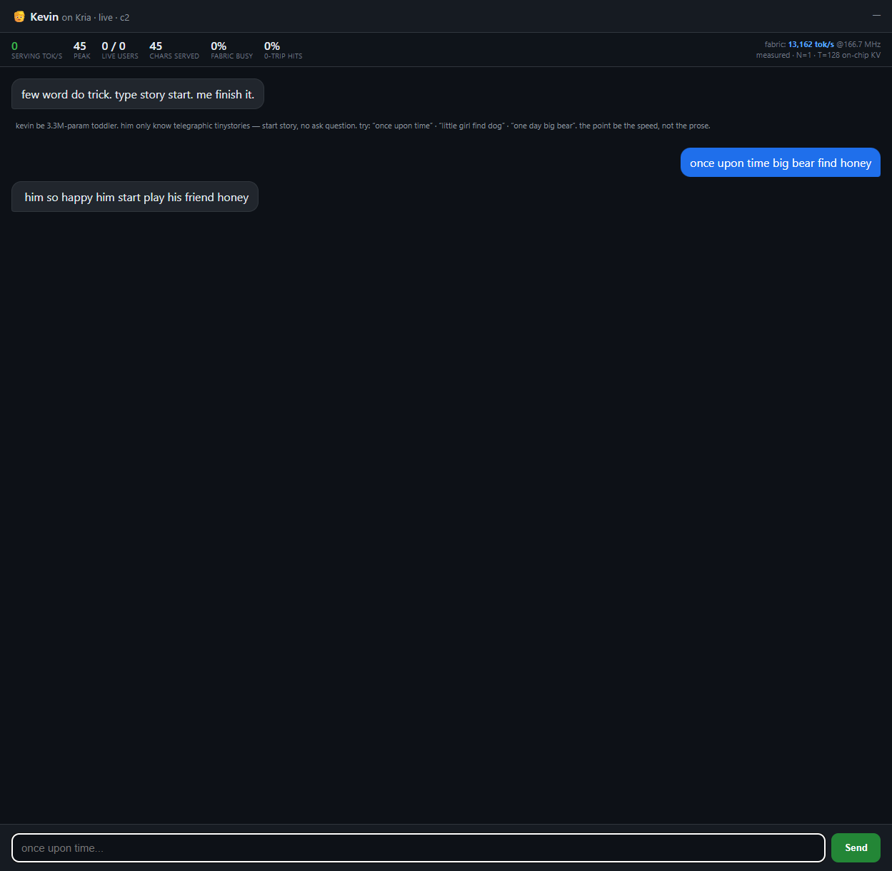
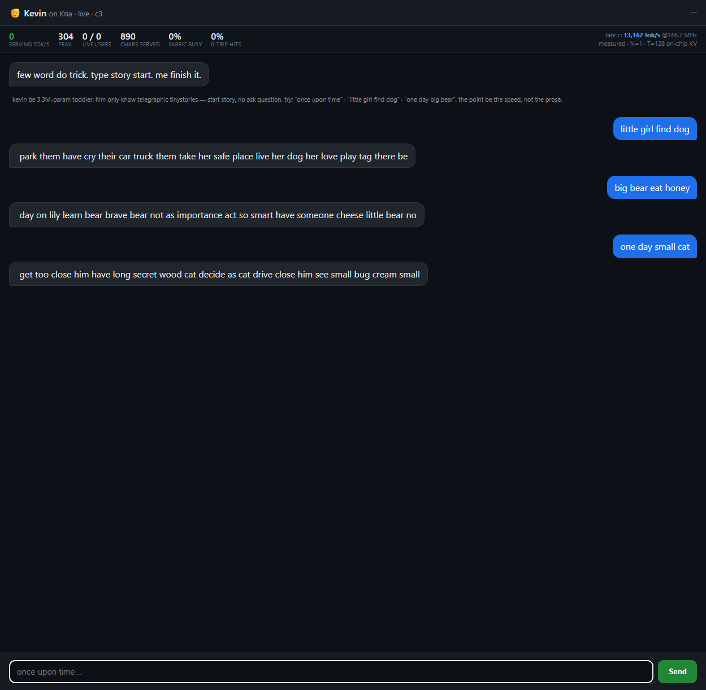

import NetworkTopology from '@/components/blog/NetworkTopology';
import RoundTripTiming from '@/components/blog/RoundTripTiming';
import SpeculativeTyping from '@/components/blog/SpeculativeTyping';
import T, { GlossaryStyles } from '@/components/blog/Term';

<GlossaryStyles />

*Part of the [on-chip LLM on a $250 FPGA](/blog/on-chip-llm-kv260/) series. The fabric being fast does not mean a reply lands fast, and getting one to a browser at all is its own small system.*

---

<NetworkTopology client:visible />

There are two public hostnames doing two completely different jobs. `chat.mikeayles.com` is the chat, and it has to be a long-lived WebSocket because it is talking to an FPGA over the LAN, so it runs through a Cloudflare named <T id="tunnel">tunnel</T> to a serving box (the "Precision"), which batches and streams and then talks to the Kria's Arm daemon over a wired <T id="tailscale">Tailscale</T> link, and the daemon is the only thing with <T id="mmio">`/dev/mem`</T> access to poke the fabric. The A53 is simply a pipe: it gets a request from the server, manages a queue, feeds a string in, and gets a hopefully longer string back a few milliseconds later.

`dash.mikeayles.com` is the live load dashboard, and it is a stateless Cloudflare <T id="worker">Worker</T>, deliberately hosted off the board so it stays up at exactly the moment the board cannot. Decouple the observer from the thing being observed.

## Two speeds, and only one of them is the chip

A live chatbot has two speeds, and conflating them is the fastest way to lie to yourself about how good your demo is. **Fabric tok/s** is how fast the silicon decodes: pure logic cycles over the clock, nothing else. **Round-trip tok/s** is how fast a reply lands in your browser: the fabric *plus* the host loop *plus* the network *plus* the tunnel. On this system they differ by more than an order of magnitude, and the gap is entirely the parts that are not the chip.

Concretely, the faithful chat decodes a full reply in about **6.6 ms** of fabric time, at ~19,240 fabric tok/s. That is the red sliver below. Everything else in the bar is tax the fabric never sees.

<RoundTripTiming client:visible />

The first bar is the sin we started with. To get variety the chat samples instead of always taking the best token, and the sampler originally lived on the host, so every single token the A53 read all 193 <T id="logits">logits</T> back over `/dev/mem` to roll the dice. Measured, that read-back was about **58% of every reply**. We were serving a ~19,000-token-per-second model through a ~1,000-token-per-second straw. Moving the sampler into the fabric with the [Gumbel-max trick](/blog/kevin-gumbel-max/) deleted that whole segment and lifted the localhost round trip to ~5,600 tok/s. The public number through the tunnel, ~1,658 tok/s, is what is left once you add honest transatlantic distance and the tunnel's own hop. None of that remainder is silicon.

## The reply is finished before you press Enter

Here is the part that turns the speed from a number into a feeling. Even ~1,658 round-trip tok/s means a reply takes tens of milliseconds to cross the Atlantic and stream back, and a spinner or a typewriter animation would advertise exactly the latency I want to hide. So the front end does not wait for Enter to start.

The trick rests on one property of autoregressive decode: typing a prompt forward is *appending* tokens, and a <T id="kv">KV cache</T> is append-only. So as you type, letter by letter, each keystroke is only **one new token to append** to the cache, not a fresh re-read of the whole prompt, and after a short debounce the fabric speculatively decodes the answer for the prompt-so-far. At ~6.6 ms of fabric work against a typing gap of ~90 ms between keystrokes, the completion is always finished, buffered client-side, before your next key lands.

<SpeculativeTyping client:visible />

By the time you hit Enter the expensive part, the prefill that is normally your <T id="ttft">time-to-first-token</T>, is already spent, for free, during the gaps between keystrokes. Enter is then not a request at all. It is a **blit**: the client renders the buffered reply in a single 60 Hz frame, zero inference on the keypress, no round trip. The one honest failure mode is a fast typist outrunning the last speculation, so there is a freshness check: if the buffer does not match the exact current input, the client fires one real authoritative inference rather than show you a stale answer. A miss converts hidden latency back into felt latency, which is why the debounce and the speculative completion length are the two knobs that matter.

Most fast-LLM demos still stream token by token, which is the honest thing to do when the round trip is your real speed. This one can pre-answer you *because* the model is small, on-chip, and dumb enough that a whole reply fits in the time between two keystrokes. It is the same fact from two sides again: the thing that makes it a bad assistant is the thing that lets it beat your fingers.

## Why a crowd suits the fabric

Single-user decode is the fabric's *weakest* case. One person typing makes each layer a <T id="gemv">GEMV</T>, a skinny vector through a huge <T id="mac">MAC</T> grid that mostly sits idle. Batch B users together and each step becomes a <T id="gemm">GEMM</T>: the resident weights are read once and reused across all B streams, and the array that was idle under one user fills up. The weakness under one user and the strength under many are the same fact seen from two sides. This is the inverse of the usual GPU serving problem, where you *must* assemble big batches to hide DDR latency; here the weights never leave on-chip, so there is no latency to hide and batching is pure upside.

The ceiling on B is memory, not compute. Each concurrent stream needs its own KV cache, those caches live on-chip beside the model, and the short context the design already mandates is what keeps each one small enough that a fair few fit. Within batch capacity everyone is served at full speed; past it, requests queue and per-user latency grows with queue depth. Watching that queue form on the live dashboard is the drama.

## The honest bottleneck

Named in advance: if this ever gets a real crowd, the thing that breaks first is almost certainly the Arm core's network stack holding thousands of concurrent WebSocket connections, not the fabric running out of inference. The fabric does single-digit-microsecond tokens from on-chip and has enormous headroom; the single gigabit port and four A53 cores in front of it do not. So the experiment honestly produces two numbers, not one: the **inference ceiling** (the fabric under synthetic local load, large) and the **serving ceiling** (the whole board under real traffic through its own network stack, modest). I built something so fast that the slow part is handling the sockets, and the gap between those two numbers is the actual result.

That is also why the dashboard lives on a Worker and not on the board. When the box is drowning, the page that shows it drowning has to be the one thing that stays up.

---

*Next: [War stories and the method](/blog/kevin-war-stories/), or back to [the main post](/blog/on-chip-llm-kv260/).*
