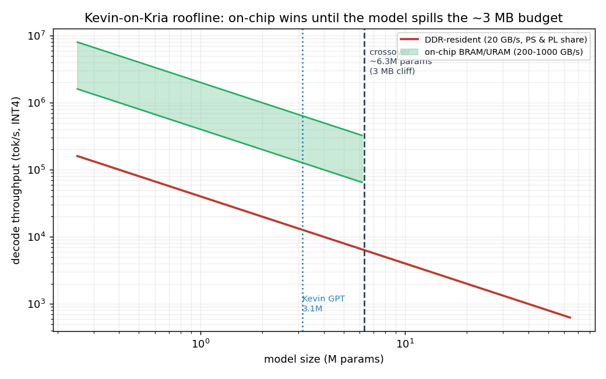

import T, { GlossaryStyles } from '@/components/blog/Term';
import SpeedLadder from '@/components/blog/SpeedLadder';

<GlossaryStyles />

*Part of the [on-chip LLM on a $250 FPGA](/blog/on-chip-llm-kv260/) series. The discipline that made the numbers trustworthy, and the scars.*

---

The rule is: **bit-honest before fast.** Every block is proven bit-exact (or cosine > 0.9999 for the transcendental approximations) against a Python reference before anyone runs a <T id="synthesis">synthesis</T> or quotes a speed. The toolchain is hand and LLM written <T id="rtl">RTL</T> (there is no <T id="hls">HLS</T> on the build box), gated in <T id="iverilog">iverilog</T> simulation, then implemented in <T id="vivado">Vivado</T>, then verified on the board with three matching runs.

Some scars from the road, because they are the actual content of the work:

- **Simulation lies in specific, learnable ways.** iverilog silently ignores out-of-range array reads and returns X, while real silicon wraps the address. One such bug, once found, made the design 14,336 cycles per token *faster*. Asynchronous reads pass every simulation gate and then do not exist on real <T id="bram">BRAM</T>. The fix is to never trust a gate you have not also run on the metal.
- **Silicon is faster than the timing report says.** <T id="sta">Static timing</T> on this part is pessimistic by 1.3x to 1.76x. Designs that close at 70 to 85 MHz on paper run bit-exact at 125 to 200 MHz on the board. So the policy is: build at a clock that closes, then find the real ceiling with a board-side frequency sweep, and never quote the number until the tokens match.
- **Build outside OneDrive.** The repo lives in a OneDrive folder, and OneDrive's cloud-sync filter will lock multi-gigabyte build files mid-run and corrupt them. Every build scratch dir lives on a plain local path. This cost a confusing afternoon exactly once.
- **The race I won and stopped anyway.** There was a whole campaign ("the double-pump") to run the multiplier at twice the fabric clock. It worked, it was bit-exact on silicon, and it could not beat the record on this chip, all three at once, because a faster clock island still has to be *fed* by the fabric, and the fabric was the wall the whole time. The correct engineering move was to write the post-mortem and stop, rather than chase a beat-by-a-nose past a wall we had already documented. Knowing when to stop is a result too.

## The ladder

Every green rung is measured on silicon, three runs, token stream bit-exact against the integer reference.

<SpeedLadder client:visible />

| Step | tok/s | The idea |
|---|---|---|
| A53 char chat | 11 | the CPU baseline, the wall |
| HW sequencer @40 MHz | 44 | take the CPU out of the loop entirely |
| wide P-lane datapath | 1,883 | one URAM word feeds 128+ lanes the same weight |
| N=8 single-pass | 19,276 | one weight pass serves 8 streams at once |
| N=16 + softmax cut | 25,744 | the stream ceiling (single weight pass) |
| split-brain N=14 | 36,971 | two 7-stream cohorts on the dual-port URAM |
| **N=16 split-brain @ 200 MHz, full wave** | **59,965.5** | **the record (two cohorts of 8)** |

## Where it loses

- **The crossover.** The on-chip trick wins only while the model fits on-chip. The <T id="roofline">roofline</T> says the crossover is around 6.3M parameters, roughly 3 MB of <T id="int4">INT4</T>. Past that the model spills to <T id="ddr">DDR</T> and the fabric advantage evaporates back to the bandwidth wall. This is a toy-model technique by construction.
- **The KV cache spills too.** Long context blows the on-chip budget just like big weights do. The faithful build remembers a couple of short turns, not a document.
- **100k was a fantasy.** The project chased a "100k tok/s" headline and then, honestly, disowned it: the real cycle floor on this architecture lands the ceiling around 62k to 78k on this chip, not 100k. The record is 59,965, and that is the number that gets quoted.

---

*Back to [the main post](/blog/on-chip-llm-kv260/). The code is on [GitHub](https://github.com/MichaelAyles/kev-gpt).*
