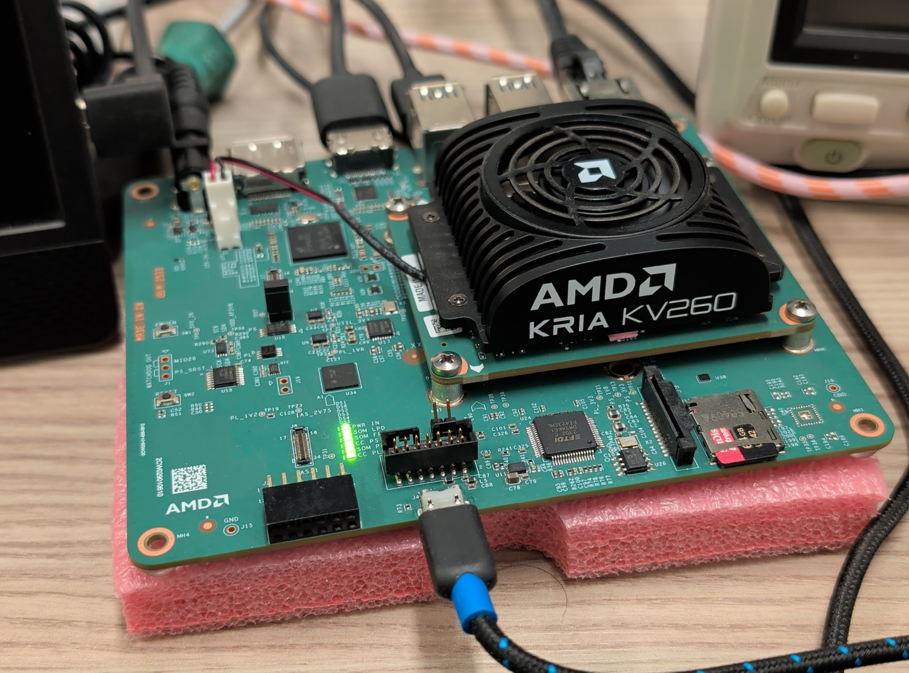

import KevinChat from '@/components/blog/KevinChat';
import BandwidthWall from '@/components/blog/BandwidthWall';
import SpeedLadder from '@/components/blog/SpeedLadder';
import T, { GlossaryStyles } from '@/components/blog/Term';

<GlossaryStyles />

I put a language model inside the <T id="fabric">fabric</T> of a $250 <T id="fpga">FPGA</T>. Every weight lives in on-chip memory. Nothing touches external RAM in the token loop, not the weights, not the activations, not the KV cache.

The headline, bit-exact and measured on silicon: **59,965 tokens per second** on the fabric. The same model on this board's own Arm cores manages 11 tok/s. My laptop's RTX 3050 Ti manages 719.

This is the same bet Taalas made, the startup AMD just acquired: if single-user inference is bound by how fast you can read the weights, stop fetching them from far away. Taalas etches a model's weights into custom silicon as transistors and gets 17,000 tok/s out of a Llama 8B. I loaded mine into the UltraRAM of AMD's own $250 Kria KV260 dev board. Theirs needs a foundry re-spin to change models. Mine reprograms in 25 seconds. Theirs is 8 billion parameters and can spell. Mine is 3 million parameters and talks like Kevin Malone. We'll get to why.

First, talk to it.

## The live demo

This widget is a real WebSocket connection to the board. Your words go through a Cloudflare tunnel, to a serving box, to the Kria, into the fabric, and back. If the status dot is green, you are talking to transistors. It's a story generator, not an assistant. It doesn't understand questions. Give it "once upon a time" and it finishes it.

<KevinChat client:visible />

Yes, the output is bad. It has to be, and the reason it has to be is the actual engineering content of this post.

## Why I even had this board

I bought the KV260 for a different side project, a deterministic vision pipeline. The board is sold as a "vision AI starter kit," but the Vitis object detection runs on the quad core A53s, and the A53 is a weak core with no hardware matmul. The Vitis libraries turned out to be basically OpenCV on Linux rather than anything that pushes the fabric. If I wanted probabilistic AI running on a CPU, I sure as heck wouldn't choose a quad core A53.

So the fabric was sitting there, and then I saw the Taalas demo. I wondered how far I could push a consumer board toward the same idea.

## The wall

One fact drives everything. Generating one token at a time is **memory bound, not compute bound**. To produce the next token you read every weight in the model once. The arithmetic is cheap, the reading is the cost.

On the KV260, the A53s and the fabric share one DDR controller at roughly 20 GB/s. If the model lives in DDR, the fabric and the CPU drink through the same straw and the fabric buys you nothing. The round trip to DDR or CPU over AXI kills you. The only escape is a model small enough that all of it fits in on-chip memory, where bandwidth is hundreds of GB/s. This is Taalas' insight, and Groq's, and Cerebras': the memory wall is the enemy and on-chip weights are the escape. They spend hundreds of millions of dollars enlarging the on-chip budget. The KV260 gives you about 3 MB.

<BandwidthWall client:visible />

3 MB has to hold the weights, the activations, and the KV cache. That is not enough room for a smart model. It is barely enough room for a model that can string a sentence together. So the second lever, the one the big players mostly can't pull: shrink the model until the problem disappears.

## Making the model small enough (this is where Kevin comes in)

A 3.16M-parameter INT4 transformer fits in ~1.5 MB. That's the budget met, but every byte still counts, and the last lever toward speed kept turning out to be "make the model dumber."

So the training corpus (TinyStories) is run through a tool that strips English to its content words. "Why waste time saying a lot of words when a few words do the trick" becomes "why waste time say lot word when few word do trick." Yes, that's Kevin Malone's communication philosophy from The Office, and yes, the model consequently talks like him. Across the full corpus the compression takes 371.7M words down to 260.5M, about 70%, measured.

I expected the compressed-corpus model to come out smaller. It came out exactly the same size, and in hindsight that's obvious: the parameter count is fixed by the architecture, not the corpus. What the compression does is shrink the output distribution. The same story takes ~30% fewer characters to tell, so effective speed goes up even though the per-token rate is identical. The dumbness is the optimisation.

Honest version: the lemmatised corpus buys about 1.5x. The order-of-magnitude win is on-chip versus DDR. Kevin is the garnish, not the meal.

## Chasing 100k

My goal was 100,000 tok/s. I didn't get there, and the shape of the failure is the most interesting part.

The record build is 16 parallel streams sharing one weight pass, entirely sequenced in the fabric, CPU touching nothing. It measures **59,965.5 tok/s at 200 MHz**, 16 of 16 streams bit-exact against the integer reference, three runs of three. The confession: those sixteen streams remember *nothing*. Each decodes with an attention window of one token. A chat built on it emits one faithful character and falls down the stairs, "he he he he he." It is fast and it is meaningless, and those are the same property taken one step too far.

So the deployed chat is a different, honest build. One stream, full trained context window, KV caching bit-exact to a full recompute. That one runs **~19,240 tok/s of fabric** and remembers your last couple of turns. It's the one in the widget above. Neither number gets to borrow the other's headline.

The path from 11 tok/s to 60k was a ladder, every rung measured on silicon:

<SpeedLadder client:visible />

And the ceiling is proven, not assumed. There's a script that falsifies packing a third MAC into a DSP48E2 over 1.2M randomised products, and N=32 needs 2,048 DSPs the chip doesn't have. The real limit of this architecture on this silicon is 62k to 78k. 100k was a fantasy and I've disowned it.

## Where it loses

The on-chip trick only wins while the model fits on-chip, and the crossover is around 6.3M parameters. Past that you spill to DDR and you're back at the wall. Long context spills the KV cache the same way. This is a toy-model technique by construction, and the output is bad on purpose, which does not make it good. It's a measurement instrument with a sense of humour.

For scale: Taalas etches weights into transistors on a taped-out ASIC per model. Cerebras keeps 44 GB of SRAM on a wafer. Groq keeps 230 MB per chip and gangs hundreds of them. Same one-sentence insight at budgets from nine figures down to the price of a nice dinner.

## Go deeper

Everything above is the story. The engineering is in the sub-articles, and every number in them is bit-exact on silicon before it's quoted:

- **[Inside the chip](/blog/kevin-inside-the-chip/)**, the wide-word GEMV trick, the dual-port split-brain, the non-linear bricks, and the proof that 16 streams is a hard ceiling.
- **[Sampling without asking](/blog/kevin-gumbel-max/)**, how one unmeasured host loop ate 58% of every reply, and the Gumbel-max identity that collapsed 193 reads per token into one seed write.
- **[Serving an FPGA to strangers](/blog/kevin-serving-strangers/)**, the tunnel, the serving box, and why the dashboard deliberately lives off the board.
- **[War stories and the method](/blog/kevin-war-stories/)**, where iverilog lies, why silicon beats the timing report by 1.3 to 1.76x, and the optimisation I won and stopped anyway.

It's all hand-written Verilog, no HLS. Claude Code did a moderate amount, it's a side project on a side project after all, though pushing an FPGA to its limit is definitely not as comfortable for it as writing a CRUD app in TypeScript.

## The receipt

**59,965.5 tok/s at 200 MHz, measured, N=16, bit-exact, three runs of three.** The deployed chat is the faithful build at ~19,240 fabric tok/s, live at [chat.mikeayles.com](https://chat.mikeayles.com) and right here. Same thesis as the startup AMD just bought, on AMD's own $250 board, reprogrammable in 25 seconds.

Possible, practical, and measurable.
